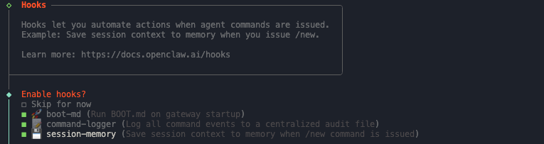
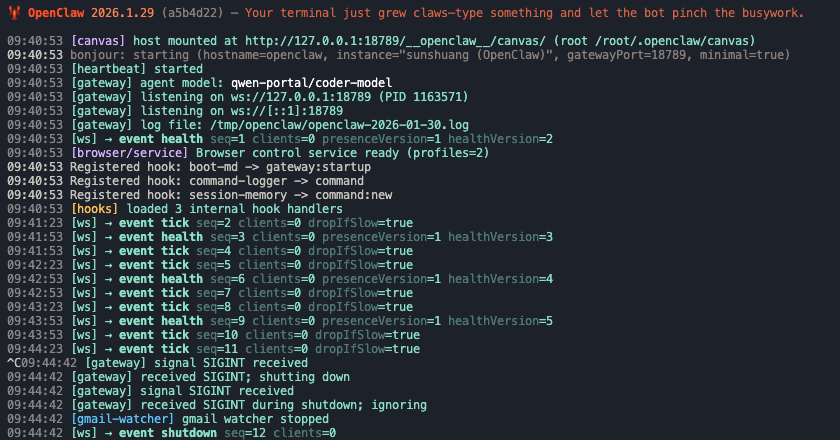

**前言**

近期，OpenClaw（原名 Clawdbot）火爆了。作为一款具备高度主动性的本地 Agent，它拥有深入系统底层的权限，无论是执行 Shell 命令、自动化提交 Git PR、管理数据库，还是无缝对接 Telegram 等通讯应用，OpenClaw 全都游刃有余。它最迷人的地方在于“Skills”插件，这意味着用户可以按需扩展功能，赋予它近乎无限的进化可能。

因版权缘故，它经历从 Clawdbot 到 moltbot 的演变，现更名为 OpenClaw（官网：[openclaw.ai](https://openclaw.ai/)）。本教程将带你体验这一爆火工具，手把手教你如何在 openEuler 操作系统上完成 OpenClaw 的部署。

## 在openEuler 上快速部署 OpenClaw 
### 1. 安装 Node.js
将本机 Node 升级到 >22，或者使用 nvm 安装 Node.js。

```shell
curl -o- https://raw.githubusercontent.com/nvm-sh/nvm/v0.40.3/install.sh | bash
source ~/.bashrc 
nvm install 22 
nvm use 22 
nvm alias default 22

# 验证 Node.js 版本：
node -v # Should print "v22.22.0".

# 验证 npm 版本：
npm -v # Should print "10.9.4".
```

### 2. 安装 OpenClaw
通过官网提供的命令行工具安装 OpenClaw。
```shell
curl -fsSL https://openclaw.bot/install.sh | bash
```
安装完成后，会出现 OpenClaw 交互界面。


### 3. 配置 OpenClaw
因配置环节流程较多，经筛选后仅展示关键配置，用户可根据个人需求和喜好自行进行配置。

#### 3.1 配置模型

OpenClaw 支持各大 LLM 公司的模型，也支持本地模型。openEuler 以 Qwen 进行示例。


当出现下面链接时，请点击并前往 Qwen 网站进行认证关联：


#### 3.2 频道配置

频道选择全部是海外，国内用户可以选择“直接跳过”，后续会教大家使用飞书来启动。


#### 3.3 Skills 配置
可以按需选择，或者直接跳过，后续对话过程也可以安装。


#### 3.4 hooks安装

官方使能的 3 条 hooks 建议全部安装。

- boot-md 是启动时自动加载一段 markdown 文本当作默认引导内容，常用于把你的规则、偏好、项目背景这些在每次启动时塞进去。
- command-logger 是把在OpenClaw 里执行过的命令和关键操作记一份日志，方便排查问题和复盘。
- session-memory 是保存会话相关的状态或记忆，让它下次能延续上下文，体验会更连贯。




### 4. 启动 OpenClaw
看到安装好的界面后，使用`` openclaw gateway --verbose`` 命令来启动 OpenClaw。



启动后查看 OpenClaw 运行状态：
```shell
# 查看clawbot是否在后台运行
openclaw health

# 查看模型状态
openclaw models list
```

### 4. 访问 web 界面
端口转发后才能访问 web 界面。
```shell
# OpenClaw 只能通过 locahost 方式访问
ssh -L 18789:127.0.0.1:18789 root@你的服务器公网ip

# 获得 token=
clawdbot dashboard
```

直接在浏览器输入 127.0.0.1:18789/?token=xxxxxx 就可以访问 OpenClaw 的“小龙虾界面”了。


